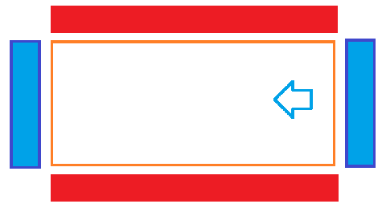

# Полоса испытаний
```
⚙ Необходимо: мяч, верёвки, флажки
```
> **Правила:** Играют 2 команды, команда *"красных"* становится по бокам больших сторон игрового поля, их задача выбить команду *"синих"*. Игроки *"синих"* стоят на зоне возле надписи "старт", как только игрок синей команды заходит в поле, его может выбить игрок красной команды. Задача игрока *"синей"* команды перебежать на противоположную стороны, там его запятнать не могут, однако, чтобы заработать очко команде, ему нужно вернуться обратно. Однако стартовать обратно игрок *"синей"* команды может только тогда, когда все сокомандники перебежали и стоят по одну сторону игрового поля. Если тебя выбили ты садишься в том же месте, где тебя выбили. Игра заканчивается, когда всех игроков *"синей"* команды выбьют

